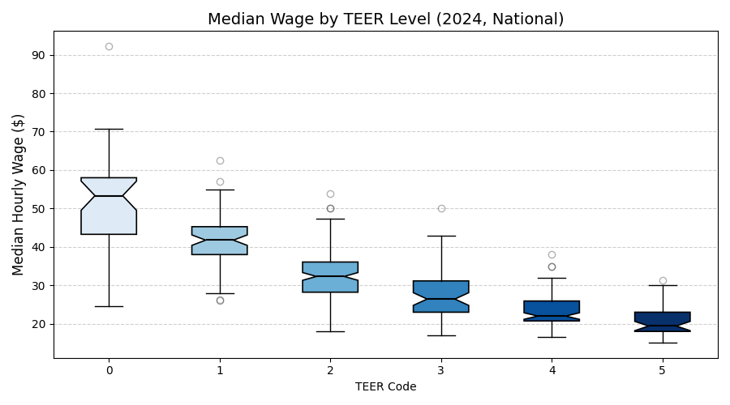
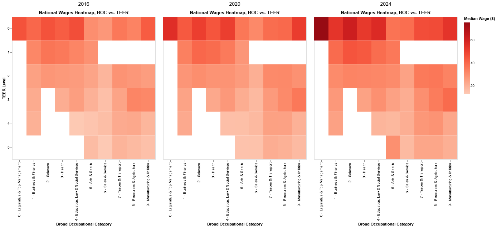
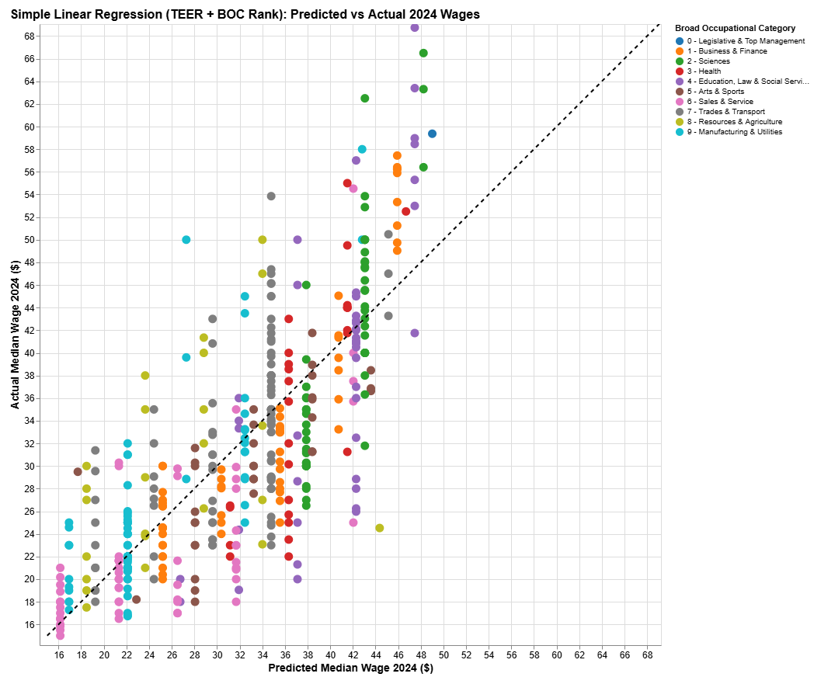

# WageCAN Project
Data-driven insights into wage disparities and economic patterns in Canada (2016–2024)

**Project Goal**  
WageCAN aims to analyze Canadian wage trends over time by integrating data from 2016, 2020, and 2024.  
The project focuses on understanding occupational wage disparities, regional patterns, and the impact of evolving NOC classifications.

---

**Block 0: Data Preprocessing**
This block processes raw Canadian wage datasets from 2016, 2020, and 2024, merges them, and maps occupational codes (NOC 2016 → NOC 2021). It generates the cleaned dataset merged_wages_2016_2024_mapped_to_NOC2021.csv for further analysis.

**Key actions:**
 - Read and inspect 2016, 2020, and 2024 datasets.
 - Clean and normalize wage and occupation columns.
 - Map NOC 2016 codes to NOC 2021 using a refined mapping file.
 - Merge 2016, 2020, and 2024 wage data.
 - Engineer new features: Broad Category, TEER Level, Major Group.
 - Save cleaned output in `/output/csv/`.

---

**Block 1: Exploratory Data Analysis (EDA)**
This block explores wage patterns at national, provincial, and regional levels, identifies trends and outliers, and creates interactive visualizations.

**Key actions:**
- Analyze national wage distributions by year, TEER level, and Broad Category.
- Compare provincial wages (Top 3 vs. Bottom 3 provinces).
- Detect regional wage outliers in 2024.
- Investigate wage fluctuation patterns within occupations.
- Generate boxplots, heatmaps, summary tables, and Altair charts.
- Save `national_df.csv` and `provincial_df.csv` for further analysis.

---

**Block 2: Clustering Analysis**
This block applies clustering techniques to identify wage patterns among occupations and across provinces.

**Key actions:**
- Perform K-Means clustering (k=4 and k=7) on occupations using wages and TEER levels.
- Conduct provincial wage clustering to detect NOCs with consistent vs. divergent wage patterns.
- Apply hierarchical clustering on provincial wage profiles.
- Identify occupation outliers within clusters.
- Generate interactive PCA plots, heatmaps, and clustering summaries.
- Save clustering results and outlier analyses in `/output/figures` and `/output/logs/`

---

**Block 3: Modeling and Wage Prediction**
Builds regression models to predict 2024 wages based on occupation attributes and historical wage patterns.

**Key actions:**
- Create a custom wage index combining TEER and Broad Category ranks.
- Train simple linear regression models (TEER + BOC Rank) to predict wages.
- Develop Random Forest and Gradient Boosting models using TEER, Broad Category, Province, and embedded NOC Titles.
- Train and evaluate embedding-only models using sentence embeddings of occupation titles.
- Model wage growth stability by predicting 2024 wages from 2016 and 2020 data.
- Visualize model performance (predicted vs actual wages).
- Save model evaluation metrics and results to `/output/logs/` and `/output/figures/`

---

# 📁 Project Structure

WageCAN_Project/  
├── data/             # Raw and intermediate datasets (input files)  
├── output/  
│   ├── csv/          # Processed and analysis-ready datasets  
│   ├── figures/      # Charts, interactive plots, and model visualizations  
│   ├── logs/         # Summary logs, model evaluation reports  
├── src/              # Main project scripts (Block 0, Block 1, Block 2, Block 3)  
├── README.md         # Project overview and documentation

**Numbering Convention:**

All outputs (figures, logs, reports) follow the block numbering system.
For example, results from Block 2 are named 2-#, results from Block 3 are named 3-#, ensuring easy mapping between code, outputs, and documentation.

**Selected Interactive WageCAN charts are available here:**  
🔗 [WageCAN Interactive Visualizations](https://nickshlepov.github.io/WageCAN_Project/)

## Selected Results Visualizations

  

<i>Figure 1. Median Wage in Canada in 2024 vs. TEER.</i>

 

  

<i>Figure 2. National Wages Heatmap, BOC vs. TEER.</i>

 

  

<i>Figure 3. National Actual Wages vs. Predicted by the CustomIndex.</i>

